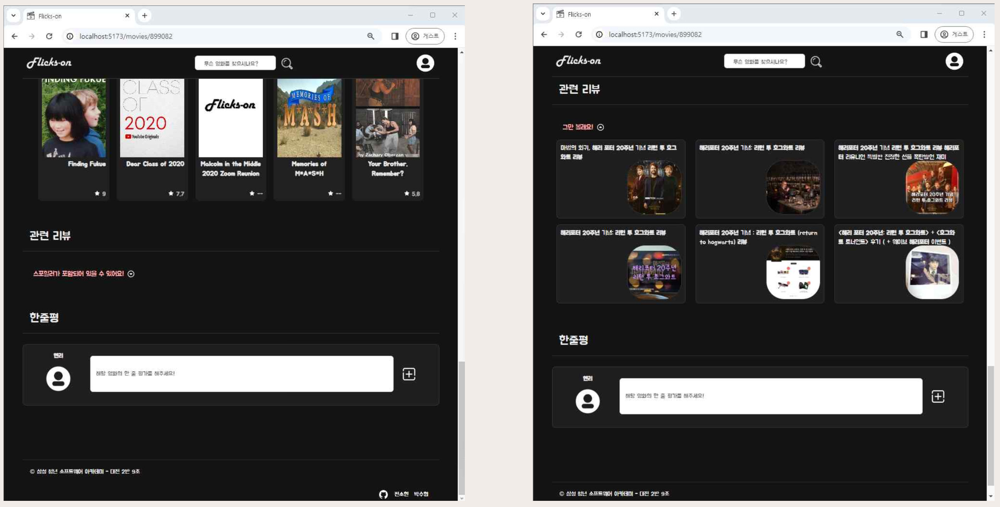

# 최우수상 수상
# 1. 팀원 정보 및 업무 분담 내역
### - `대전 2반 9조`
- 박수형
    - 구현 목록 초안
    - 발표
    - `Front, Back`
        - Comment CRUD
    - `Front`
        - Vue Components Tree 초안
        - 같은 route를 사용하는 컴포넌트 간 url로 이동 가능하게 구현
    - `Back`
        - ERD 작성
        - 전체 Model 작성 및 TMDB API를 이용해 DB 데이터 작성
        - Login, SignUp 구현, 최초 로그인 시 취향을 설정할 수 있게 설정
        - rest-auth 커스텀 &rarr; user deatil serializer 커스텀
        - TMDB API 로 불러 온 영화 데이터 일부 조작
        - 취향을 기반으로 영화 추천 알고리즘 제작
        - 시리얼라이저 작성
    - `CSS`
        - 배너
- **전소현**
    - 구현 목록 1차 수정
    - PPT
    - `Logo` - 제작
    - `Front, Back`
        - Project, App 생성
        - Comment CRUD
    - `Front`
        - Vue Components Tree 1차 수정, 2차 수정, 3차 수정 (완성)
        - 페이지 초안 구현
        - TMDB API Data 불러오기 (현재 상영작, 인기작, 관련 영화, 검색 기능, 트레일러)
        - 카카오 API 를 사용하여 영화 제목 + '리뷰' 을 검색해서 타사이트의 리뷰를 볼 수 있도록 함
    - `Back`
        - ERD 초안
    - `CSS`
        - 헤더, 배너(bootstrap-carosel), 푸터, 영화 리스트 카드, 단일 영화 카드, 단일 영화 유튜브 트레일러(modal), 단일 영화 리뷰(modal), 댓글 CRUD 컴포넌트, 검색 페이지, 프로필 페이지
        - 로그인 페이지, 회원 가입 페이지, 취향 선택 페이지, 회원 정보 수정 페이지
### - 일정 및 업무 부담
- 23.11.16 (목) : 가이드 라인 확립 (설계서, 구조도, ERD, DB 등)
- 23.11.17 (금)
    - `Front` : Components Tree 에 따라 Vue Project 구체화
    - `Back` : TMDB 데이터를 이용하여 Dummy Data 생성, Serializer 작성 후 의도대로 동작하는지 확인
- 23.11.18~19 (주말)
    - `Front` : Components Tree 변경 및 완성, 그에 따른 Vue Project 구체화 -> 전 페이지 초안 완성
    - `Back` : signup, login, 현재 로그인 하고 있는 유저의 정보 return 값 customizing
- 23.11.20 (월)
    - `Front` : Comment CRUD, TMDB API Data 불러오기 (현재 상영작, 인기작, 관련 영화)
    - `Back` : Comment CRUD
- 23.11.21 (화)
    - `Front` : 관련 영화 TMDB API 부분 디버깅, TMDB API Data 불러오기 (개봉 예정작, 검색 기능, 유튜브 트레일러)
    - `Back` :
    - `CSS` : 메인-영화 리스트, 헤더, 푸터, 디테일-영화 정보
- 23.11.22 (수)
    - `Front` : signup 함수 수정 &rarr; 최초 로그인 시 장르 선택, 같은 url에서 parameter만 수정한 url로 접속 시도 시 안되던 버그 수정 (디테일 페이지, 검색 페이지), 검색 페이지 엔터로 검색되게 버그 수정
    - `Back` : Comment Read 부분 버그 발생으로 인한 Serializer 수정
    - `CSS` : 각 페이지의 제목 메세지, 디테일-유튜브 트레일러, Comment CRUD, 프로필 페이지, 검색 페이지, 로그인 페이지, 회원 가입 페이지, 취향 선택 페이지, 회원 정보 수정 페이지
- 23.11.23 (목)
    - `Front` : 카카오 API 를 기반 디테일-리뷰 컴포넌트 추가, 메인 페이지 배너 보완
    - `Back` : 개인별 추천 알고리즘 보완

# 2. 목표 서비스 구현 및 실제 구현 정도<br>
### 회원가입
<br>
<br>
<br>

### 영화 추천 & 검색 페이지
<br>

### 영화디테일 페이지
<br>
<br>

### 디테잎 페이지 > 평론가 리뷰
<br>
<br>

### 디테잎 페이지 > 댓글
<br>
<br>

### 개인 맞춘 영화 추천 & 회원정보 수정 페이지
<br>

### - 서비스 목표
- 주제 : 맞춤 영화 추천이 필요한 사람들을 위한 영화 추천 알고리즘 기반 커뮤니티 서비스
- 특색
    - 아이디어
        1. 날씨 API : 날씨 데이터와 오늘의 기분을 기반으로 영화 추천
        2. 카카오 API : 영화 제목 + '평론가 리뷰' 을 검색해서 타사이트의 리뷰를 볼 수 있도록 함
        3. 카카오 API : AI 챗봇 사용
        4. 유저의 장르별 선호 점수를 이용, 영화의 평점을 계산해서 제일 높은 순으로 추천
    - 채택<br>
        2. 카카오 API : 영화 제목 + '평론가 리뷰' 을 검색해서 타사이트의 리뷰를 볼 수 있도록 함<br>
        4. 유저의 장르별 선호 점수를 이용, 영화의 평점을 계산해서 제일 높은 순으로 추천<br>
- 기술 스택 : Vue, Django

### - 구현정도

|ID|Depth 1|Depth 2|내용|
|:--:|:--:|:--:|:--|
|`user`|로그인 / 회원관리|회원가입|아이디, 비밀번호, 이름, 사용자 이름<br>장르별 선호도 입력<br>가입 완료 클릭 시 로그인 완료|
|`user`|로그인 / 회원관리|로그인|아이디 비밀번호 입력<br>오류가 있으면 오류메시지 출력<br>로그인 완료 시 메인 페이지로 이동|
|`user`|로그인 / 회원관리|로그아웃|로그아웃 후 메인 페이지(로그인)로 이동|
|`user`|프로필 페이지|회원정보 수정|아이디 변경 불가<br>이름, 이메일 변경 가능<br>수정 완료 후 프로필 페이지로 이동|
|`user`|프로필 페이지|취향 영화 추천|회원 가입 시에 입력했던 장르별 선호도 점수를 통해 취향 영화 추천|
|`movie`|영화 페이지|영화 메인 페이지|여러가지 분류(현재 상영작, 인기작, 개봉 예정작)에 따른 영화 리스트<br>제목, 평점|
|`movie`|영화 페이지|영화 상세 페이지|특정 영화의 정보 열람<br>영화 제목, 장르, 평점 합계, 러닝타임<br>간단한 줄거리, 관련 콘텐츠 (트레일러, 평론가 리뷰)<br>유사 영화 추천, 유저 한줄평|
|`movie`|영화 페이지|영화 검색 페이지|제목의 키워드에 따라 영화 검색|
|`comment`|댓글 관리|댓글 작성|디테일 페이지에서 작성 가능|
|`comment`|댓글 관리|댓글 보기|해당 게시글 페이지에서만 출력<br>해당 댓글 작성자, 댓글 내용 출력|
|`comment`|댓글 관리|댓글 수정|해당 게시글 페이지에서만 출력<br>해당 댓글 작성자, 댓글 내용 출력<br>작성자만 삭제 가능|
|`comment`|댓글 관리|댓글 삭제|작성자만 삭제 가능<br>삭제 후 해당 페이지의 그 부분만 새로고침|
# 3. ERD & Components Tree
### - ERD (추후 수정 예정) <br>
- 초안<br>
<br>

- 1차 수정안<br>
<br>

- 최종<br>
<br>

### - Components Tree<br>
- 초안<br>
<br>
- 1차 수정안<br>
<br>
- 2차 수정안<br>
<br>
- 3차 수정안 (최종)<br>
<br>

# 4. 영화 추천 알고리즘에 대한 기술적 설명
```python
def recommend_movies(request, user_pk):
    id_score = []
    like_movie_list = []
    for item in request.data['user_genre'][0].items():
        if item[1] > 0:
            movies = Movie.objects.filter(**{item[0]: True})
            for movie in movies:
                if movie.tmdb_id:
                    score = item[1] * movie.movie_rate
                    id_score.append([movie.tmdb_id, score])
                    like_movie_list.append(movie)

    id_score.sort()
    res = [id_score.pop()]
    while id_score:
        tmp = id_score.pop()
        if tmp[0] == res[-1][0]:
            res[-1][1] += tmp[1]
        else:
            res.append(tmp)
    
    res.sort(key=lambda x: -x[1])

    movies = []
    for movie_info in res:
        for movie in like_movie_list:
            if movie_info[0] == movie.tmdb_id:
                movies.append(movie)
                break

    serializer = MovieSerializer(movies, many=True)
    return Response(serializer.data)
```
- 유저가 회원 가입시 선택한 장르를 기반으로 영화를 1차 필터링
- 장르 선택시 기입한 선호도 점수를 바탕으로 영화 장르별로 가중치를 넣고 해당 가중치와 영화 평점을 기반으로 영화 선별
- 예를 들어, 평점 5점의 영화가 있고 유저가 기입한 장르의 가중치가 각각 5와 1이라면 해당 영화는 가중치로 25 + 5 를 가짐

# 5. 서비스 대표 기능에 대한 설명
- 회원 가입시에 작성한 정보를 기반으로 유저 페이지에서 영화 추천
- 메인 화면에서 현재 상영작, 인기작, 개봉 예정작을 추천
- 키워드로 영화 검색 가능
- 단일 영화 페이지에서 영화 정보, 관련 영상 (트레일러), 관련 영화, 관련 리뷰 모달 (Kakao API, 평론가 리뷰로 검색), 유저 한줄평

# 7. 느낀점
### 전소현
- 서비스하고 싶은 기능도 많았고, CSS 로 꾸미고 싶은 기능도 많아서 짧은 시간 안에 모든 걸 구현해내기에 시간도 능력도 많이 부족했지만, 생각보다 많은 것을 해낼 수 있음에 놀랐다.
- 여전히 욕심도 많아서 사소한 것에 조금만 더 조금만 더를 외치다가 결국 시간이 자꾸 딜레이되었지만, 많이 검색해보고 찾아보는 동안 실력이 많이 늘었다.
- 대략적인 계획은 생각하고 작업했지만, 조금 더 구체적인 계획을 잡는 게 필요할 것 같다.
- 강의를 듣고, 실습을 따라가는 것과 프로젝트를 하는 것은 정말 다른 것 같다. 계획 내에 끝내는 법, 팀원 간 소통하는 법, git 으로 협업하는 방법 등 많은 것을 배운 계기가 되었다.
### 박수형
- 초기에 데이터베이스 모델을 설계할 때 프로세스가 아닌 데이터 성격을 기준으로 했어야 했는데 그러지 못해서 수정할 일이 많았고, 모델을 설계할 때 업무와 연관성은 있어야 하지만 데이터베이스가 의존성이 더 적어야 한다는 사실을 깨달았다.
- 라이브러리를 사용해 본적은 많았지만, 이렇게까지 많은걸 커스텀해서 사용해 본적은 없어서 처음에는 당황 했지만, 계속 해서 디버깅 해보고 정보를 찾아보며 라이브러리를 커스텀해서 사용할 때는 공식문서의 어디를 참고해야 하는지 검색은 어떻게 해야하는지 배울 수 있었다.
- 팀원과 협업을 할 때, 기술적으로 프론트엔드와 백엔드를 분리해서 한게 아니라서 같은 기능을 사용할 때 서로 기준이 다른 경우 달라 토의하는 일이 많았는데 이런 때에 어떻게 소통해야 하는지, 어떻게 해야 내 의견을 더 명확하게 전달할 수 있는지 배울 수 있었다. 같은 이유로 git을 merge하는 과정에서 conflict가 나거나 branch 명이 겹치는 경우가 종종 있어서 git이 터지는 일이 생겼었는데 이런 경우에도 어떻게 해야 이런 참사를 더 줄일 수 있는지 배울 수 있었다.
# 8. Bug Report
## 1. nickname 불러오기
- 로그인 후 닉네임을 불러오려고 했으나, rest_auth를 이용해 login을 진행 한 경우 return 되는 항목이 토큰 외에 다른것은 찾을 수 없었음.
### - 시도해본 것들
- 기존에 배포받은 pdf파일에 들어있는 내용처럼 git hub에 들어가 login 항목들을 찾아보고 커스텀을 시도해 보려 했으나 실패
    - 한시간 정도 잡고 시도해 보려 했으나 rest_auth에 있는 방식은 단순히 함수를 불러오는 것이 아니라 class를 호출하여
    진행하는 방식이어서 익숙하지 않았음.
    - class 내부에 있는 로그인 함수가 serializer를 참조해와서 사용하고 있었지만 rest_auth 역시 django의 몇몇 기본 기능을
    상속받아 사용하고 있어서 git hub 자체에서는 확인이 불가능 했음.
- url을 살펴보는 와중 로컬 파일에 있는 항목을 수정하여 커스텀 하려고 했으나 시도하지 않음
    - venv는 ignore 에 작성되어 있어서 로컬에서만 수정이 가능하고 rest_auth만 ignore 리스트에서 지워서 작업하기엔 번거로워 질 것 같고, 시간을 더 많이 소요 할 것으로 예상되어 시도하지 않았다.
- final-pjt-back/urls.py 에 직접 url을 작성하고 accounts/views.py에 함수를 작성하여 호출 해 시도
    ```
    Internal Server Error: /getuserinfo/user10/
    Traceback (most recent call last):
    File "C:\Users\44968\OneDrive\바탕 화면\Flicks-on\back\venv\lib\site-packages\django\core\handlers\exception.py", line 55, in inner
        response = get_response(request)
    File "C:\Users\44968\OneDrive\바탕 화면\Flicks-on\back\venv\lib\site-packages\django\core\handlers\base.py", line 197, in _get_response
        response = wrapped_callback(request, *callback_args, **callback_kwargs)
    File "C:\Users\44968\OneDrive\바탕 화면\Flicks-on\back\accounts\views.py", line 13, in get_user_info
        return Response(serializer.data)
    File "C:\Users\44968\OneDrive\바탕 화면\Flicks-on\back\venv\lib\site-packages\rest_framework\serializers.py", line 555, in data
        ret = super().data
    File "C:\Users\44968\OneDrive\바탕 화면\Flicks-on\back\venv\lib\site-packages\rest_framework\serializers.py", line 253, in data
        self._data = self.to_representation(self.instance)
    File "C:\Users\44968\OneDrive\바탕 화면\Flicks-on\back\accounts\serializers.py", line 43, in to_representation
        ret = super().to_representation(instance)
    File "C:\Users\44968\OneDrive\바탕 화면\Flicks-on\back\venv\lib\site-packages\rest_framework\serializers.py", line 522, in to_representation
        ret[field.field_name] = field.to_representation(attribute)
    File "C:\Users\44968\OneDrive\바탕 화면\Flicks-on\back\venv\lib\site-packages\rest_framework\fields.py", line 915, in to_representation
        return int(value)
    TypeError: int() argument must be a string, a bytes-like object or a number, not 'DeferredAttribute'
    ```
    
    - 다음과 같은 오류 발생
    - age 필드가 비어 있어서 발생한 오류로 추정
    - user의 serializer를 다음과 같이 수정
    ```python
    class UserInfoSerializer(serializers.ModelSerializer):
    class Meta:
        model = User
        fields = ('nickname', )
    ```
    ```
    Internal Server Error: /getuserinfo/user10/
    Traceback (most recent call last):
    File "C:\Users\44968\OneDrive\바탕 화면\Flicks-on\back\venv\lib\site-packages\django\core\handlers\exception.py", line 55, in inner
        response = get_response(request)
    File "C:\Users\44968\OneDrive\바탕 화면\Flicks-on\back\venv\lib\site-packages\django\core\handlers\base.py", line 220, in _get_response
        response = response.render()
    File "C:\Users\44968\OneDrive\바탕 화면\Flicks-on\back\venv\lib\site-packages\django\template\response.py", line 114, in render
        self.content = self.rendered_content
    File "C:\Users\44968\OneDrive\바탕 화면\Flicks-on\back\venv\lib\site-packages\rest_framework\response.py", line 55, in rendered_content
        assert renderer, ".accepted_renderer not set on Response"
    AssertionError: .accepted_renderer not set on Response
    ```

    - 다른 오류 발생 &rarr; api_view 데코레이터를 달지 않아서 발생했던 오류 였음( 해결 )
    - serializer를 통해 리턴한 객체에 nickname 값이 다음과 같이 출력
        ```
        nickname: "<django.db.models.query_utils.DeferredAttribute object at 0x000001EC196FFA60>"
        ```
    - rest_auth 를 이용해 signup과 login을 진행해 발생한 오류로 추정 django에서 print로 확인했을 때도 동일하게 출력
    - rest_auth의 login 함수를 커스텀 해야 할 것으로 보임 &rarr; 첫 번째 방식으로 돌아갈 듯
- rest_auth의 LoginView class 를 상속받는 CustomLoginView 클래스 작성해서 시도
    - view 함수에 다음과 같이 작성
    ```python
    class CustomLoginView(LoginView):

        def login(self, request):
            self.user = self.serializer.validated_data['user']
            token_model = get_token_model()

            if api_settings.USE_JWT:
                self.access_token, self.refresh_token = jwt_encode(self.user)
            elif token_model:
                self.token = api_settings.TOKEN_CREATOR(token_model, self.user, self.serializer)

            if api_settings.SESSION_LOGIN:
                self.process_login()

            response_data = {
                'token': self.token,
                'user_id': self.user.pk,
                'username': self.user.username,
            }

            return self.get_response(request, response_data=response_data)
    ```
    - urls.py 수정
    ```python
    urlpatterns = [
        path('admin/', admin.site.urls),
        path('api/v1/', include('movies.urls')),
        path('login/', views.CustomLoginView.as_view()),
        path('accounts/', include('dj_rest_auth.urls')),
        path('accounts/signup/', include('dj_rest_auth.registration.urls')),
    ]
    ```
    - TypeError: login() missing 1 required positional argument: 'request' 오류 발생 &rarr; request 제거
    - TypeError: get_response() got an unexpected keyword argument 'response_data' 오류 발생 &rarr; request 추가
    - get_response에만 request를 추가하면 없는 인자를 추가한 것 이어서 안댐
    - rest_auth login 함수에는 request가 없는데 잘 동작 하는데 어떻게 한건지 모르겠다.
    - 여러번의 시도 끝에 view 함수 안에 있는 serializer에 username, email, password만 들어있는걸 찾아냄 serializer를 수정해야된 다는 사실을 깨달음
    - registration 을 커스텀 했던 것 처럼 커스텀 해야 함
    - 기존에 serializer를 호출 하던 방식에서 내가 커스텀한 serializer를 넣는다.
    - 너무 많은걸 바꿔야 할 것 같아서 이건 아닌거 같다.
    - self.serializer 항목을 전부 Custom serializer로 바꿔주려 했지만 기존에 존재하는 serializer의 어떤 부분을 수정해야 하는지 모르겠다.
- 공식문서를 찾으면서 user detail을 불러 올 수 있는 url 발견
    - serializer를 custom 하고 settings 에 추가해 주니까 성공적으로 return 했다.
    - 공식문서에 따르면 put 요청 역시 이것을 통해 하면 된다고 명시되어 있음.
- 작성자 : 박수형


## 2. MovieList Components 에 원하는 Props 를 내려받아 영화 불러오기
- `MainView` &rarr; `MovieList` Components, `MovieDetailView` &rarr; `MovieList` Components 에서 원하는 Movie 정보에 따라 다른 `Props` 를 내려주고 싶었다. 

### - 시도해본 것들
- 코드 1
   ```
   import { useMovieStore } from '@/stores/movies'
   
   const movieStore = useMovieStore()
   movieStore.getNowPlayingMovie()
   const nowPlayingMovieList = movieStore.nowPlayingMovie
   console.log(nowPlayingMovieList)
   ```

- 코드 2
   ```   
   import { useMovieStore } from '@/stores/movies'
   
   const movieStore = useMovieStore()
   const nowPlayingMovieList = ref([])
   onBeforeMount(async () => {
     await movieStore.getNowPlayingMovie()
      nowPlayingMovieList.value = await movieStore.nowPlayingMovie
   })
   ```

- 코드 3
   ```
   import { useMovieStore } from '@/stores/movies'

   const movieStore = useMovieStore()
   const nowPlayingMovieList = ref([])
   const isDataLoaded = ref(false)
   onMounted(async () => {
     try {
       await movieStore.getNowPlayingMovie()
       nowPlayingMovieList.value = movieStore.nowPlayingMovie

       isDataLoaded.value = true
     } catch (error) {
       console.error('Error fetching movie list:', error)
     }
   })
   ```

- 이외에도 여러 가지 방식으로 코드를 작성해보았으나, 모든 코드가 동작은 되지만 비동기 처리로 인해 첫 렌더링 때 영화를 불러오지 못했다. (메인 &rarr; 다른 페이지로 이동했다가 뒤로 가기하면 재렌더링될 때는 로딩이 됨)
- 페이지 첫 렌더링과 데이터 로딩 비동기 처리에 대해 고민해보았으나 성공하지 못하고, 다른 방식으로 코드 작성을 완료하였다.
- 결국, 다른 데이터를 가지고 있는 똑같은 컴포넌트를 여러 개 만들었다.
- `MovieListNowPlaying` Component, `MovieListTopRated` Component, `MoviesListSimilar` Component
- 작성자 : 전소현

## 3. MovieListSimilar Components 에서 MovieDetailView 를 다시 불러오기 (같은 route 의 다른 variable routing 의 route 로는 컴포넌트가 새로고침 x)
    ```
        @click="goPage('movie_detail', movie.id)"
    ```
- `MovieList` Components &rarr; `MovieDetailView` &rarr; `MovieDetail` Components, `MovieListSimilar` Components 로 연결된다.
- `MovieListSimilar` Components 에서 `MovieDetailView` 를 다시 불러오는 과정에서, 새로운 영화들의 데이터를 가져오고 싶었다.

### - 시도해본 것들

- 코드 1.
    ```
   const goPage = function (pageName, id) {
     router.push({name: pageName, params: {title: id}})
     router.go(0)
   }
   ```

- 코드 2.
    ```
   const goPage = function (pageName, id) {
      네비게이션 가드에서 디버깅을 위해 훅을 추가
     router.beforeEach((to, from, next) => {
       console.log('Before route update', { to, from });
       next();
     });
     router.push({ name: pageName, params: { title: id } });
   }
    ```

- 코드 3.
    ```
   const goPage = function (pageName, id, forceReload = false) {
     if (forceReload) {
       window.location.href = `#/${pageName}/${id}`
     } else {
       router.push({name: pageName, params: {title: id}})
     }
   }
    ```

- 코드 4.
    ```
   const goPage = function (pageName, id) {
     router.go({name: pageName, params: {title: id}, replace: true})
   }
    ```

- 코드 5.
    ```
   const goPage = function (pageName, id) {
     router.replace({name: pageName, params: {title: id}})
   }
    ```

- 코드 6.
    ```
   const goPage = function (pageName, id) {
     router.replace({name: pageName, params: {title: id}})
     window.location.reload()
   }
    ```

- 코드 7
    ```
   const goPage = function (pageName, id) {
     router.push({name: pageName, params: {title: id}, replace: true})
   }
    ```

- 코드 8
    ```
   const goPage = function (pageName, id) {
     router.replace({name: pageName, params: {newId: id}})
   }
    ```

- 코드 9 (해결)
    ```
    onBeforeRouteUpdate((to, from) => {
        movieStore.getSimilarMovie(to.params.title)
    })
    ```
- page url 이 변경되지만, 같은 route 의 다른 variable routing 의 route 로는 컴포넌트가 새로고침이 되지 않았다.
- `onBeforeRouteUpdate` 를 이용하여 해결하였다.
- 작성자 : 전소현, 박수형